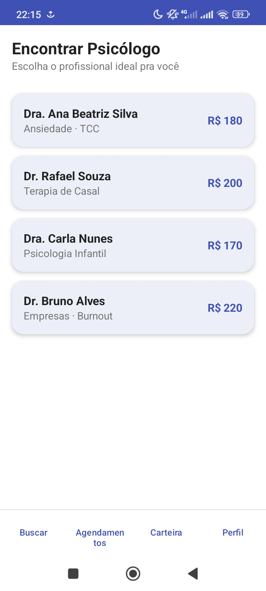
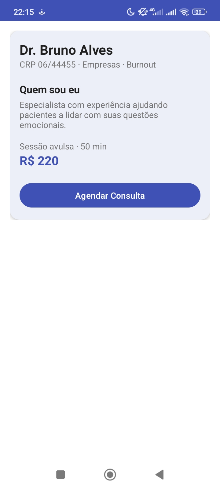
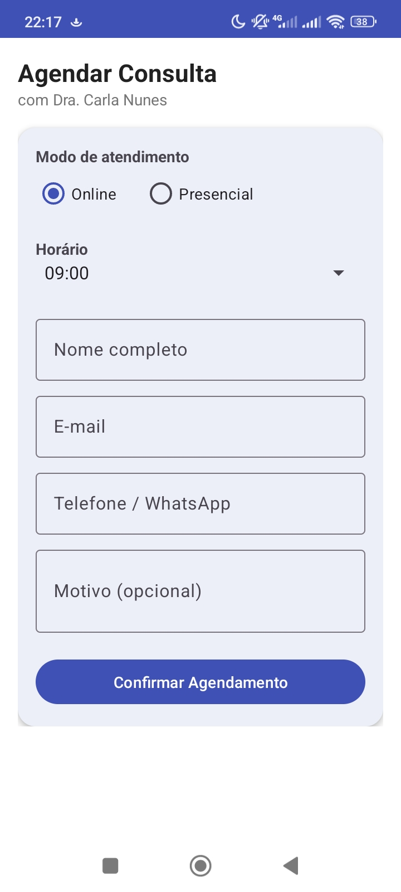
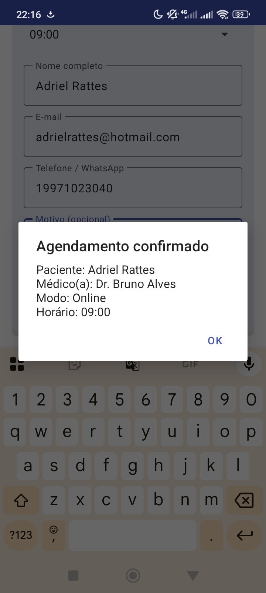

# PsiConnect Mobile

App Android (Java) do PsiConnect — marketplace de psicólogos, perfil do profissional e agendamento — reconstruído com boas práticas modernas de layout (Material Design 3):

- `colors.xml` / `themes.xml` (light + night) com nomes semânticos, sem cor fixa no layout
- `ConstraintLayout` + `MaterialCardView` + `MaterialButton`
- `RecyclerView` (lista de psicólogos) no lugar de `ListView`
- `TextInputLayout` / `TextInputEditText` no formulário de agendamento
- `strings.xml` centralizado, `dimens.xml` para espaçamento

## Telas

1. **MarketplaceActivity** — lista de psicólogos em cards, menu de navegação fixo embaixo
2. **MedicoActivity** — perfil do profissional (dados via `Intent extras`)
3. **AgendamentoActivity** — formulário de agendamento (modo, horário, dados do paciente)

## Screenshots

<table>
  <tr>
    <td></td>
    <td></td>
    <td></td>
    <td></td>
  </tr>
</table>

## Como testar

Baixe `psiconnect-mobile.apk` (raiz deste repo) ou a [última Release](../../releases/latest) e instale no Android (o Play Protect pode pedir "Instalar mesmo assim").
